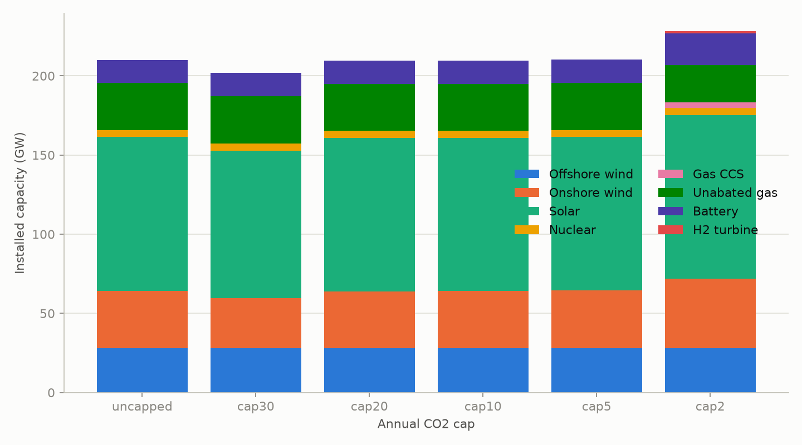
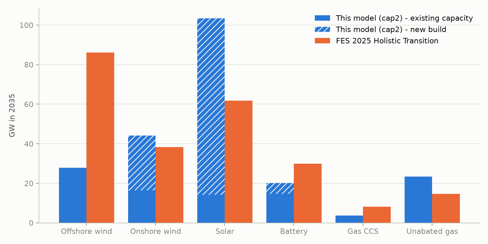
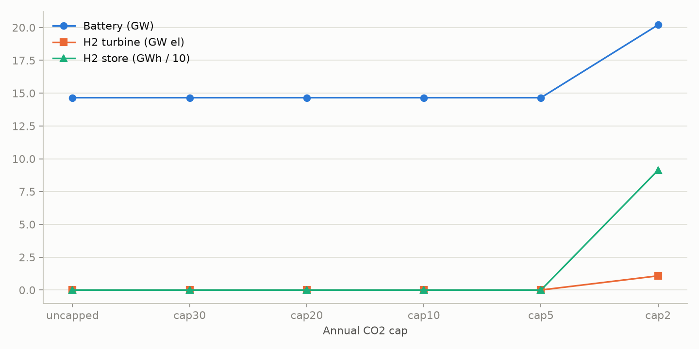
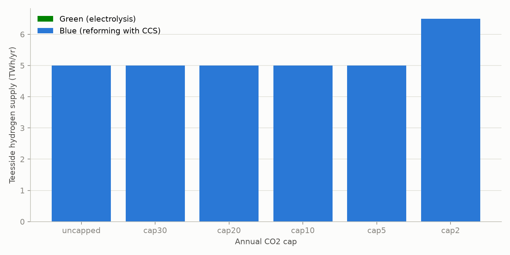

# gb-2035-pypsa

Least-cost GB power system in 2035 under tightening carbon caps, with a Teesside industrial
hydrogen node. PyPSA + HiGHS, 20 transmission zones, full-year 2019 weather, eleven solved
scenarios.

**The answer this model gives.** At DESNZ 2035 medium costs, the cheapest GB system that
meets a 5 MtCO2 cap costs 14.8 bn GBP/yr and is built on onshore wind and solar, not on new
offshore wind: 36.5 GW of onshore wind and 97.0 GW of solar against 27.9 GW of offshore, and
not one megawatt of new offshore is built at any cap in the sweep. That is the sharpest
disagreement with NESO's FES 2025 Holistic Transition, which reaches 86.1 GW of offshore by
2035; the model's own land-use caps (60 GW onshore, 150 GW solar) never bind, so what
separates the two is cost ranking rather than resource, and the planning and land-use limits
that make FES's answer the realistic one sit outside this model entirely. Tightening the cap
from 30 to 2 MtCO2 adds 2.1 bn GBP/yr and lifts the shadow carbon price from 0 to 910 GBP/t.
The Teesside hydrogen node is met entirely by blue hydrogen at 70 GBP/MWh: electrolysis is
never built at any cap, and the 5 TWh demand costs the system 355 m GBP/yr.

## Findings

1. **Cost rises gently to a 5 Mt cap, then steeply.** System cost runs 14.1, 14.3, 14.7,
   14.8 and 16.2 bn GBP/yr across the 30, 20, 10, 5 and 2 MtCO2 caps, and the shadow carbon
   price runs 0, 33, 33, 52 and 910 GBP/t
   ([`results/summary.csv`](results/summary.csv)). The 30 Mt cap is slack, so its dual is
   zero: the unconstrained optimum already emits 28.2 Mt. The 33 GBP/t plateau across the 20
   and 10 Mt caps is a structural breakpoint, the price at which an existing CCGT
   (24 GBP/MWh thermal over 0.5 efficiency plus 5 GBP/MWh variable O&M = 53 GBP/MWh, at
   0.368 tCO2/MWh) becomes dearer than a 65 GBP/MWh import: (65 - 53) / 0.368 = 32.6 GBP/t.
   Below 10 Mt that switch is exhausted and the price climbs to what new abatement costs:
   52 GBP/t at 5 Mt, then 910 GBP/t at 2 Mt, where the model has to build gas CCS and
   hydrogen storage rather than simply redispatch.

2. **At the tightest converged cap the build is solar- and onshore-heavy, with less firm
   low-carbon capacity than FES and more unabated gas.** `cap2` holds 44.0 GW onshore wind, 103.4 GW solar, 27.9 GW offshore
   wind, 20.2 GW battery, 3.6 GW gas CCS and 23.4 GW unabated gas
   ([`results/cap2/summary_row.csv`](results/cap2/summary_row.csv)). FES 2025 Holistic
   Transition for 2035 has 38.4 GW onshore, 61.8 GW solar, 86.1 GW offshore, 29.8 GW battery
   plus 10.5 GW of long-duration storage, 8.1 GW gas CCUS and 14.7 GW unabated gas
   ([`data/derived/fes2025_gb_2035.csv`](data/derived/fes2025_gb_2035.csv)). The model buys
   67 percent more solar and 15 percent more onshore wind than FES, and 68 percent less
   offshore wind.

3. **Offshore wind loses on cost, and the caps that would have forced it in never bind.** No
   greenfield offshore is built in any of the eleven scenarios; the 27.9 GW reported
   throughout is the REPD operational-plus-under-construction fleet
   ([`results/summary.csv`](results/summary.csv), `offwind_new_gw` is zero in every row). At
   the committed 2035 costs, greenfield offshore annuitises to 345,807 GBP/MW-yr against
   onshore's 137,259 and solar's 41,392
   ([`data/derived/costs_2035_gb.csv`](data/derived/costs_2035_gb.csv)), which even at
   offshore's much better capacity factors works out at 63.3 GBP/MWh at Dogger Bank and 74.7
   at East Anglia, against 41.7 to 47.8 for mainland onshore and 34.5 to 41.8 for solar
   ([`data/derived/cf_2019_zonal.parquet`](data/derived/cf_2019_zonal.parquet)). DESNZ folds
   an 86,700 GBP/MW-yr connection charge into offshore's fixed O&M on its own, about two
   fifths of the 208,500 GBP/MW-yr annuitised gap to onshore.
   Onshore stops at 44.0 GW of a 60 GW national cap and solar at 103.4 GW of 150 GW, so
   nothing forces the model up the cost curve to offshore. FES's 86.1 GW reflects planning
   consent, land use and public acceptability for onshore and solar, none of which this model
   represents.

4. **Blue hydrogen wins Teesside outright, and storage only appears at 2 Mt.** Blue hydrogen
   supplies the full 5.0 TWh industrial demand in every scenario that has one, and
   electrolysis is built at 0.0 GW everywhere, so green hydrogen is 0.0 TWh throughout
   ([`results/summary.csv`](results/summary.csv)). Across the cap sweep batteries stay at the
   existing 14.7 GW until the 2 Mt cap adds 5.5 GW of new build (the only other scenario that
   builds any is `cap5_ee_demand`, at 2.7 GW), and 2 Mt is also the only cap that builds a
   hydrogen store (91.3 GWh) and a hydrogen turbine (1.1 GW electrical, returning 0.8 TWh)
   ([`results/cap2/hydrogen.csv`](results/cap2/hydrogen.csv)) - and even that store is
   filled by blue hydrogen, whose output rises to 6.5 TWh, not by electrolysis.

5. **The Teesside node costs the power system 355 m GBP/yr, and the number decomposes
   exactly.** `cap5` costs 14.8 bn GBP/yr against `cap5_no_h2`'s 14.5 bn, a difference of 355
   m GBP/yr ([`results/summary.csv`](results/summary.csv)). The Teesside H2 bus clears at
   71.0 GBP/MWh ([`results/cap5/duals.csv`](results/cap5/duals.csv)), which is blue
   hydrogen's 70 GBP/MWh plus its residual 0.02 tCO2/MWh valued at the 52 GBP/t shadow price;
   71.0 GBP/MWh over 5 TWh is 355 m GBP/yr, the coupling effect. The hydrogen demand does not
   displace generation, it buys carbon budget: unabated gas falls only from 5.0 to 4.9 Mt to
   make room for blue hydrogen's 0.1 Mt
   ([`results/cap5/emissions.csv`](results/cap5/emissions.csv)).

6. **Imports at 100 GBP/MWh cost 1.9 bn GBP/yr and flip GB from importer to exporter.**
   `cap5_import_100` costs 16.7 bn GBP/yr against `cap5`'s 14.8, and its shadow carbon price
   more than doubles to 128 GBP/t. Net imports go from +14.6 TWh to -4.3 TWh: imports fall
   from 58.5 to 50.9 TWh while exports rise from 43.9 to 55.2 TWh
   ([`results/cap5_import_100/energy.csv`](results/cap5_import_100/energy.csv)). The system
   replaces the lost imports with 7.5 GW more onshore wind and 2.5 GW more solar
   ([`results/summary.csv`](results/summary.csv)).

7. **Transmission expansion is worth nothing here, even though Scotland to England binds.**
   With every corridor extendable, `cap5_tx_expansion` builds 0 MW of new link and costs
   0.1 m GBP/yr less than `cap5` on a 14.8 bn base, which is inside the solver tolerance
   ([`results/cap5_tx_expansion/flows.csv`](results/cap5_tx_expansion/flows.csv), every
   `p_nom_new_mw` is zero). That is not because the grid is slack: the two modelled
   Scotland-to-England corridors, Z7-Z2 at 6 GW and Z7-Z6 at 8 GW, total 14.0 GW against
   ETYS 2035's 19.3 GW B6 capability, and Z7-Z2 runs at 100 percent of rating in 3.0 percent
   of hours at `cap5` and 4.5 percent at `cap2`
   ([`results/cap5/flows.csv`](results/cap5/flows.csv),
   [`results/cap2/flows.csv`](results/cap2/flows.csv)). Congesting a corridor for a few
   hundred hours a year is simply cheaper than annuitising more of it.

## Results

The table below is generated by `gb2035 report --update-readme` from
[`results/summary.csv`](results/summary.csv). Eleven scenarios, all solved at 3-hourly
resolution on the code at commit `f47bd8b`; `cap0p5` is missing because it did not converge
(see [Resolution and solver](#resolution-and-solver)). Two columns need care: `uncapped`'s
total includes carbon payments at 55 GBP/t, which are a transfer rather than a resource cost,
so it is not comparable with the capped rows; and blue hydrogen has no capex, so its capacity
is always its 1.2 GW cap and only its TWh are meaningful.

<!-- summary:start -->
| Scenario | CO2 (Mt) | System cost (bn GBP/yr) | Shadow carbon price (GBP/t) | Onshore (GW) | Offshore (GW) | Solar (GW) | Battery (GW) | Electrolysis (GW) | Green H2 (TWh) | Blue H2 (TWh) |
|---|---|---|---|---|---|---|---|---|---|---|
| uncapped | 4.6 | 15.1 | 0 | 36 | 28 | 97 | 15 | 0.0 | 0.0 | 5.0 |
| cap30 | 28.2 | 14.1 | 0 | 32 | 28 | 93 | 15 | 0.0 | 0.0 | 5.0 |
| cap20 | 20.0 | 14.3 | 33 | 36 | 28 | 97 | 15 | 0.0 | 0.0 | 5.0 |
| cap10 | 10.0 | 14.7 | 33 | 36 | 28 | 97 | 15 | 0.0 | 0.0 | 5.0 |
| cap5 | 5.0 | 14.8 | 52 | 37 | 28 | 97 | 15 | 0.0 | 0.0 | 5.0 |
| cap2 | 2.0 | 16.2 | 910 | 44 | 28 | 103 | 20 | 0.0 | 0.0 | 6.5 |
| cap5_no_h2 | 5.0 | 14.5 | 52 | 36 | 28 | 97 | 15 | 0.0 | 0.0 | 0.0 |
| cap5_ee_demand | 5.0 | 16.0 | 226 | 42 | 28 | 105 | 17 | 0.0 | 0.0 | 1.3 |
| cap5_tx_expansion | 5.0 | 14.8 | 52 | 36 | 28 | 97 | 15 | 0.0 | 0.0 | 5.0 |
| cap5_import_100 | 5.0 | 16.7 | 128 | 44 | 28 | 99 | 15 | 0.0 | 0.0 | 5.0 |
| cap5_steel | 5.0 | 15.0 | 52 | 38 | 28 | 98 | 15 | 0.0 | 0.0 | 5.0 |
<!-- summary:end -->










## Method

One linear program sizes capacity and dispatches it hour by hour across 20 GB transmission
zones (PyPSA-GB's zonal topology, inherited from UK-Calliope) plus a 21st hydrogen bus at
Teesside, joined by 31 fixed transport-model links.

Every technology splits into a brownfield unit, fixed at the REPD or DUKES capacity already
built or under construction and charged fixed O&M only, and a greenfield unit extendable
from zero at annuitised capex plus fixed O&M. Nuclear is the two committed stations (4.46
GW); pumped hydro and interconnectors are fixed and carry no fixed cost at all.

Snapshots cover the 2019 weather year scaled to a FES 2035 demand total. A single PyPSA
`GlobalConstraint` caps annual CO2 from gas, gas CCS and blue hydrogen, and its dual is the
shadow carbon price reported per scenario; `uncapped` drops the constraint and prices carbon
at the UK ETS level instead. Costs are PyPSA technology-data v0.15.0 for 2035 converted at
0.85 GBP/EUR, with DESNZ Electricity Generation Costs 2025 overriding the eight technologies
it covers. The solver is HiGHS.

Full detail, including the components table and the scenario definitions:
[`docs/methodology.md`](docs/methodology.md). Every sourced number:
[`docs/assumptions.md`](docs/assumptions.md).

## Resolution and solver

The published sweep runs at 3-hourly resolution: every third hour of 2019, 2,920 snapshots
carrying an objective weight of 3 so annual totals stay right. It is a subsample, not an
average. The solver is HiGHS's PDLP first-order method at 1e-5 primal and dual feasibility
tolerances, because simplex does not finish a full-year solve in a usable time: on a
four-week slice simplex needed about 20 minutes to reach optimal, and interior point without
crossover took about three minutes but terminated at status "unknown". PDLP solves a
3-hourly year in 6 to 63 minutes per scenario, the longest being `cap2`, the tightest
converged cap (`solve_seconds` in each `results/<scenario>/run_meta.json`).

An hourly `cap5` reference in [`results_hourly/cap5/`](results_hourly/cap5/) says what the
3-hourly subsample costs in accuracy. Against
[`results/cap5/summary_row.csv`](results/cap5/summary_row.csv), the hourly run
([`results_hourly/cap5/summary_row.csv`](results_hourly/cap5/summary_row.csv)) puts total
system cost at 14.9 bn GBP/yr against 14.8, 0.4 percent higher; the shadow carbon price is
52 GBP/t in both (52.4784 hourly against 52.4789); new onshore wind is 21.0 GW against 20.2
and new solar 82.0 GW against 82.9; new offshore wind, electrolysis, hydrogen store and
hydrogen turbine are zero in both. Net imports are 13.5 TWh hourly against 14.6. The hourly
solve took 1,490 seconds against the 3-hourly 1,090. Three-hourly therefore understates cost
slightly and shifts about 1 GW between onshore wind and solar, and leaves every qualitative
finding intact.

The 0.5 MtCO2 scenario (`cap0p5`) is defined in `config/scenarios.yaml` but is **not** in the
results: PDLP never converged on it and the run was killed after 1 hour 50 minutes, against
at most 63 minutes for every scenario that did finish. That cap leaves only about 0.4 Mt for unabated gas once
blue hydrogen's 0.1 Mt is paid for, which drives the LP into the near-vertical part of the
abatement curve, exactly where a first-order method crawls. The sweep therefore reports 30
down to 2 MtCO2, and `cap2` is the tightest converged cap throughout this README.

PDLP satisfies constraints to within tolerance rather than at an exact vertex, so its duals
are less precise than a simplex solution's, the shadow carbon price included. Differences
below about 0.1 m GBP/yr on a 14.8 bn base, such as the `cap5_tx_expansion` cost delta, are
inside that tolerance and should not be read as signal. The one-week `test` regression
harness used by CI pins simplex instead (`config/scenarios.yaml`), because PDLP's termination
status was not reproducible across platforms at that horizon: optimal on macOS ARM64,
"unknown" on Linux x86_64.

## Run it

```bash
uv sync --all-extras --group dev
uv run gb2035 run --scenario test      # one week, solves in under a minute, no downloads needed
uv run gb2035 run --scenario cap5      # full year, 5 MtCO2 cap
uv run gb2035 report                   # results/summary.csv
```

Derived inputs are committed, so a fresh clone solves offline. `uv run gb2035 retrieve` fetches
the pinned raw sources (checksums in `data/manifest.json`) if you want to rebuild them with
`uv run gb2035 build-derived`; regenerating the wind and solar profiles needs the 765 MB ERA5
cutout and the `profiles` extra.

## What this model does not claim

Out of scope by design: multi-year pathways, unit commitment, AC power flow, reserve and
inertia products, distribution networks, demand-side response beyond electrolysis and
storage, biomass and BECCS (excluded to keep the carbon accounting free of negative
emissions), Northern Ireland, and endogenous interconnector expansion.

Limitations recorded while building it:

- Interconnectors are price-takers: imports at 65 GBP/MWh and exports at 45 GBP/MWh, with
  unbounded volume up to 19.4 GW each way. There is no foreign market to clear against, so
  trade volumes are an upper bound on what a coupled market would deliver.
- Dispatch is a continuous LP. No start costs, minimum stable generation, minimum up or down
  times, or reserve and inertia requirements.
- Brownfield capacity is sunk and charged fixed O&M only, but pre-existing nuclear, pumped
  hydro and interconnectors carry no fixed cost at all. Absolute system cost is therefore
  understated by roughly their fixed O&M. That understatement is the same in every scenario,
  so cost *differences* between scenarios are unaffected.
- Nuclear is 4.46 GW, Hinkley Point C plus Sizewell B only, against FES 2025 Holistic
  Transition's 5.04 GW for 2035.
- The East Anglia offshore profile comes from the nearest ERA5 cells the cutout covers: the
  Zenodo GB cutout ends at longitude 1.75 while the lease area reaches about 3.15, so that
  zone's capacity factor is drawn from water further west than the real site.
- ERA5's roughly 25 km cells inflate onshore capacity factors for the small, coastal and
  island zones (Shetland 0.615, the Western Isles 0.518, Argyll 0.537).
- 17 MW of REPD multi-site portfolio rows (refs 1613 and 1616) have no coordinates and are
  dropped from `repd_by_zone.csv`.
- The 2019 demand shape stamps clock-change days naively, duplicating two half-hours in
  October and fabricating one hour in March: about 0.0003 percent of annual energy, which
  does not propagate because the series is rescaled to a FES demand total.
- Blue hydrogen has no capex in the cost table, so its reported capacity always equals its
  1.2 GW cap whether or not it runs. Read its output from `hydrogen.csv`, not its capacity.
- `capacities.csv` lists both interconnector legs at full capacity each, so interconnector
  generator `p_nom` sums to 38.8 GW for 19.4 GW of physical capacity.
- `costs.csv` carries memo rows flagged by `is_memo`; they must be read as memos, not summed
  with the component rows.
- Zonal demand is split by the author's own ONS-based population weights
  (`config/demand_weights.csv`), not an official GSP-level breakdown.

## Data and licences

Every external input is pinned in [`data/manifest.json`](data/manifest.json) with its URL,
SHA-256 checksum and licence; `gb2035 retrieve` downloads and verifies each one. What each
source is, what is derived from it and how, is in
[`docs/data_sources.md`](docs/data_sources.md).

Inputs are MIT (PyPSA-GB), Open Government Licence v3 (DESNZ REPD and Electricity Generation
Costs 2025), the NESO Open Data Licence (2019 demand history, FES 2025 Data Workbook) and
CC-BY-4.0 (the Zenodo ERA5 cutout, and technology-data's data; its code is GPL-3.0).
Renewables.ninja was not used because its GB files are CC BY-NC. This repository's own code
is MIT ([`LICENSE`](LICENSE)).

## Built on

- [PyPSA](https://github.com/PyPSA/PyPSA) for the formulation, and
  [HiGHS](https://highs.dev/) for the solve.
- [PyPSA-GB](https://github.com/andrewlyden/PyPSA-GB) for the 20-zone topology, inter-zone
  link capacities and power station locations, which it inherits in turn from
  [UK-Calliope](https://github.com/calliope-project/uk-calliope).
- [PyPSA technology-data](https://github.com/PyPSA/technology-data) v0.15.0 for 2035 costs.
- NESO's [Future Energy Scenarios 2025](https://www.neso.energy/publications/future-energy-scenarios-fes)
  for the 2035 comparison pathways and ETYS 2025 for boundary capabilities.
- DESNZ for the Renewable Energy Planning Database and Electricity Generation Costs 2025.
- The [Zenodo ERA5 cutout for GB](https://zenodo.org/records/18325225) (CC-BY-4.0), run
  through [atlite](https://github.com/PyPSA/atlite) for the wind and solar profiles.
- The author's earlier repositories: `gb-weather-to-price-forecasting` (the battery
  arbitrage LP, its round-trip efficiency and wear cost, and the REPD capacity weighting),
  `heat-pump-peak-demand-modelling` and `uk-onshore-wind-siting` (the onshore siting caps).
- Systemiq's Steel-IQ for the engineering conventions (frozen configuration, the manifest
  with checksums, the test tiering and architecture test) and for the steel scenario's route
  vocabulary: [`docs/steel_iq_link.md`](docs/steel_iq_link.md).
